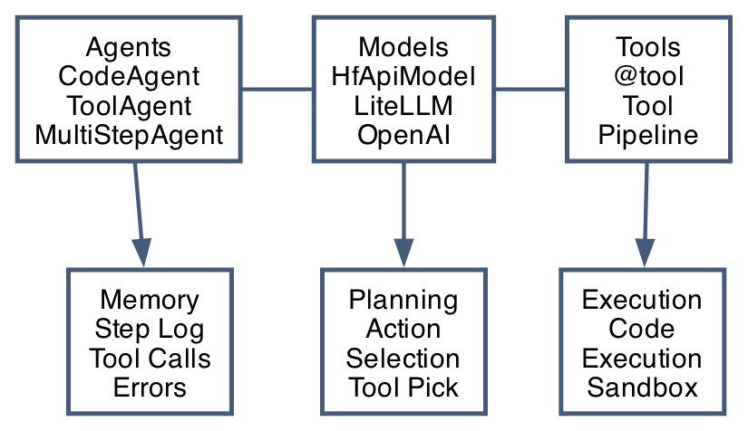
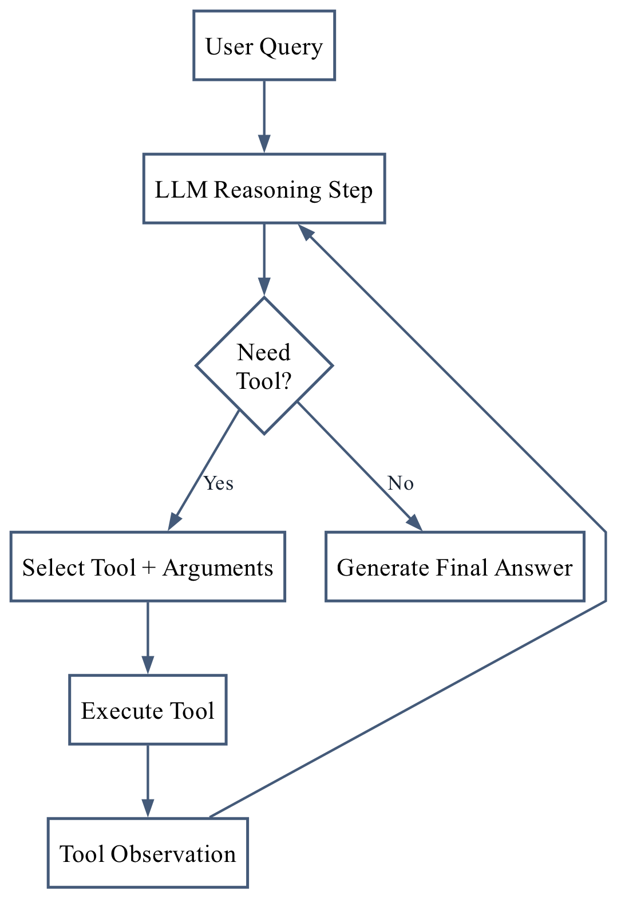
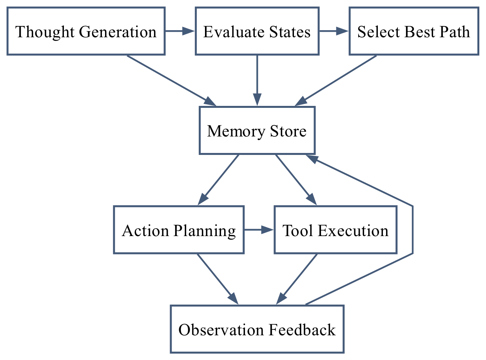

<div class="container" role="main">

# Tree of Thoughts Meets Hugging Face Agents

A Survey of Tree of Thoughts and Hugging Face Agent Frameworks

<div class="section front-matter">

**Authors:** Michael Leydon<sup>1</sup>

1.  **1** Independent Researcher, United States

**Author links (Michael Leydon):** <a href="https://www.linkedin.com/in/michael-leydon/" target="_blank" rel="noopener noreferrer">linkedin.com/in/michael-leydon</a>; <a href="https://orcid.org/0009-0003-4550-275X" target="_blank" rel="noopener noreferrer">orcid.org/0009-0003-4550-275X</a>

**Version:** v1.1.1 – Pre-submission corrections (21 February 2026)

**Submission date:** TBD

**arXiv categories:** cs.AI (primary); cs.CL (cross-list), cs.LG (optional cross-list)

</div>

<div class="abstract">

<div class="abstract-title">

Abstract

</div>

Large Language Models (LLMs) have demonstrated remarkable capabilities across diverse tasks, yet standard autoregressive decoding is left-to-right and often commits to a single trajectory per sample, without explicit mechanisms for alternative-path exploration, backtracking, or branch-level comparison. This can constrain effectiveness on complex multi-step problems requiring deliberation and planning. Concurrently, the emergence of AI agent frameworks has enabled LLMs to interact with external tools and execute actions autonomously, but these systems often struggle with strategic reasoning and error recovery \[1, 3, 4, 6, 8, 9\].

This paper presents a focused technical synthesis (rather than an exhaustive systematic review) of two developments in artificial intelligence: Tree of Thoughts (ToT) reasoning and the Hugging Face agent ecosystem. We examine how structured search over reasoning paths can be integrated with accessible agent frameworks to create more robust autonomous systems. Through technical analysis, implementation patterns, and benchmark context from prior literature, we describe where systematic exploration can improve complex reasoning while also introducing cost and latency trade-offs \[1, 2, 10, 11, 12, 26\].

Our contributions include: (1) a thorough theoretical and practical examination of Tree of Thoughts as both a reasoning paradigm and implementation strategy; (2) detailed documentation of Hugging Face's agent frameworks, including the Agent Course educational pathway and the smolagents library; (3) architectural patterns for integrating ToT reasoning with CodeAgent and MultiStepAgent implementations; (4) synthetic case-study walkthroughs across financial analysis, creative content generation, and software engineering; and (5) practical implementation strategies, optimization techniques, and deployment patterns.

This work summarizes published research and implementation patterns so researchers and practitioners can evaluate structured-reasoning agent designs with clear evidence boundaries.

</div>

## Note on Authorship

Michael Leydon is the sole listed author of this manuscript and accepts full responsibility for final editorial review, factual accuracy, and submission accountability.

This manuscript workflow included autonomous system assistance in early drafting and human-led revision, verification, and final approval. Non-human systems are treated as contributors to process, while scholarly accountability for claims and submission remains with the listed human author.

**Keywords:** Tree of Thoughts, LLM reasoning, AI agents, Hugging Face agents, smolagents, tool-augmented reasoning, survey methodology

**Scope and evidence note.** This document is a focused technical synthesis rather than an exhaustive systematic review. It combines literature findings with implementation guidance. Reported benchmark gains (for example, ToT results on Game of 24) are attributed to cited prior work unless explicitly marked as original measurements.

------------------------------------------------------------------------

## 0. Scope and Claim Boundaries

- This paper is primarily a survey-style synthesis rather than a standalone benchmark paper.
- Code snippets are mixed: some are runnable examples, while others are architectural sketches.
- Pseudo-code and illustrative snippets are labeled explicitly in relevant sections.
- Non-empirical examples are included only as synthetic walkthroughs and are labeled accordingly.

### 0.1 Survey Research Questions

This survey is organized around the following research questions (RQs):

- **RQ1:** What technical mechanisms define Tree-of-Thought-style reasoning for LLM systems (generation, evaluation, search, and stopping)?
- **RQ2:** What empirical evidence exists for ToT-family methods across benchmark categories relevant to agentic reasoning?
- **RQ3:** How do Hugging Face agent frameworks expose integration points for structured reasoning strategies?
- **RQ4:** What are the main methodological gaps that must be closed for reproducible ToT-agent claims?

### 0.2 Survey Methodology and Protocol

We follow a transparent evidence-synthesis workflow adapted from PRISMA-style reporting \[27\] and software-engineering evidence synthesis guidance \[28, 29, 30\]. Because this is a computer-science technical survey rather than a medical meta-analysis, we apply the reporting principles (search transparency, screening traceability, and extraction reproducibility) without imposing clinical effect-size assumptions.

**Protocol scope (this version):** This manuscript freezes a core-corpus selection run (Run ID: TOT-HF-SURVEY-2026-02-19) anchored by the records listed in Section 8. Fixed selection counts and exclusion reasons are reported in Appendix D, and the corresponding extraction schema is reported in Appendix E.

Because this survey targets a narrow synthesis question (ToT-style reasoning integrated with Hugging Face agent frameworks), the frozen run begins from an explicitly pre-curated candidate set before full-text screening. Query families, screening decisions, and extraction fields are documented in Appendix D and Appendix E so this scope choice is transparent and auditable.

**Seeded-corpus clarification:** the title/abstract stage has zero exclusions in this run because the initial candidate set was pre-filtered for in-scope ToT/agent works and framework documentation prior to full-text eligibility and extraction.

#### 0.2.1 Sources and Search Strategy

Primary sources for the final frozen search protocol are: arXiv, ACL Anthology (where applicable), major ML conference proceedings (NeurIPS/ICLR/ICML), ACM Digital Library, IEEE Xplore, and official framework documentation for implementation-level claims \[10, 11, 13\].

**Core query families (representative):**

- `("tree of thoughts" OR "tree-of-thought" OR "thought search") AND ("large language model" OR LLM)`
- `("llm agent" OR "tool use" OR "tool-augmented") AND (reasoning OR planning OR search)`
- `("smolagents" OR "hugging face agents" OR "CodeAgent" OR "MultiStepAgent") AND (planning OR reasoning)`

#### 0.2.2 Inclusion and Exclusion Criteria

**Inclusion:** peer-reviewed papers or clearly attributable technical reports with reproducible method descriptions; benchmark definitions sufficiently detailed to interpret results; and framework/documentation sources required for implementation claims \[27, 28, 29, 30\].

**Exclusion:** marketing/blog-only claims without method transparency; duplicate postings of the same result without added detail; papers lacking enough methodological detail to map claims to settings; and non-English sources where core technical details cannot be verified \[27, 28, 29, 30\].

#### 0.2.3 Screening, Extraction, and Quality Appraisal

Screening proceeds in three stages: (1) title/abstract triage, (2) full-text eligibility, and (3) extraction with structured fields. Extraction fields include: problem setting, model family, search policy, evaluator type, metrics, compute/cost reporting, and stated limitations \[27, 28, 29, 30\]. We additionally tag each record by evidence strength level:

- **E1 (Empirical):** controlled benchmark comparisons with explicit metrics and setup.
- **E2 (Method/Architecture):** technically detailed design without full controlled benchmark evidence.
- **E3 (Documentation/Reference):** implementation or API material used only for framework description.

Selection-flow and extraction artifacts are provided in Appendix D and Appendix E to support reproducibility and peer-review traceability.

### 0.3 Study Selection Flow

| Stage                              | Count |
|------------------------------------|-------|
| Records identified                 | 30    |
| Duplicates removed                 | 0     |
| Title/abstract screened            | 30    |
| Full-text assessed for eligibility | 30    |
| Studies included in synthesis      | 22    |

### 0.4 Reproducibility

This survey was conducted under frozen protocol Run ID: TOT-HF-SURVEY-2026-02-19. The screening log and extraction artifacts are archived at <a href="https://github.com/quiznat/tot-hf-survey-artifacts" target="_blank" rel="noopener noreferrer">github.com/quiznat/tot-hf-survey-artifacts</a>. All code examples are labeled runnable or illustrative.

## 1. Introduction

### 1.1 The Reasoning Challenge in Large Language Models

Large Language Models have advanced rapidly in language understanding and generation. However, many standard prompting workflows still follow mostly linear reasoning traces, which can limit systematic exploration and backtracking on complex tasks \[1, 3, 4\].

When presented with a complex problem, standard LLMs generate a sequence of thoughts token-by-token, following the initial path that appears most probable at each step. This approach, while effective for many tasks, exhibits weaknesses when confronting problems requiring exploration, backtracking, or evaluation of multiple solution strategies \[1, 3, 4\].

Consider the reasoning task "Game of 24," where the objective is to use four numbers and arithmetic operations to reach 24. In this setting, single-path reasoning can become trapped in unproductive trajectories when early choices are poor \[1\].

This limitation is not merely academic. As LLMs are increasingly deployed in high-stakes applications—from medical diagnosis support to financial analysis to autonomous software engineering—the ability to reason carefully, explore alternatives, and recover from errors becomes critical \[24, 25\]. The cost of a single reasoning failure can be substantial, whether measured in financial terms, safety implications, or user trust.

### 1.2 The Rise of AI Agents and Tool Augmentation

In parallel, agent frameworks have expanded, enabling LLMs to call tools, execute code, and complete multi-step workflows \[6, 8, 9\].

Prior work such as ReAct reports that interleaving reasoning and action can improve task performance in tool-using settings \[6\]. Other agent frameworks build on related ideas.

Hugging Face contributes to this ecosystem through public educational resources (Agents Course) and lightweight tooling (smolagents), which are directly documented in this survey \[10, 11, 12\].

Yet even sophisticated agent systems face challenges. Tool selection is often heuristic rather than systematic. When a tool call fails or returns unexpected results, agents may struggle to recover. Multi-step planning remains difficult, with agents frequently losing track of overall objectives while executing individual steps \[8, 9\]. The combination of reasoning and action, while powerful, lacks the structured exploration that complex problems demand.

### 1.3 The Convergence: Structured Reasoning Meets Autonomous Agents

This paper addresses these challenges through the integration of Tree of Thoughts reasoning with Hugging Face agent frameworks. Tree of Thoughts, introduced by Yao et al. (2023), models reasoning as deliberate search over a tree of possible thought sequences rather than linear generation \[1\].

If a model generates multiple candidate thoughts at each step, evaluates their promise, and explores promising paths, reasoning can move from a single trajectory to a search process with explicit backtracking and path comparison \[1, 2\].

As a design hypothesis grounded in prior reasoning and agent literature, combining structured search with agent frameworks can support systems that \[1, 2, 6, 8, 9\]:

- **Explore multiple tool selection strategies** before committing to execution
- **Evaluate action sequences** through simulation and scoring
- **Recover from tool failures** by backtracking to alternative paths
- **Plan complex multi-step operations** with lookahead evaluation
- **Maintain coherence** across extended reasoning chains through systematic exploration

This synthesis is practically relevant because Hugging Face tooling is designed for lightweight agent experimentation and integration \[10, 12\].

### 1.4 Contributions and Structure

This paper makes the following contributions:

**Theoretical and Practical Foundation.** We provide detailed coverage of Tree of Thoughts, from its theoretical foundations in search algorithms to practical implementation patterns. This includes detailed examination of generation strategies, evaluation functions, and search algorithms (BFS, DFS, beam search) with illustrative code templates and examples.

**Framework Documentation.** We document Hugging Face's agent ecosystem, including the Agent Course curriculum, smolagents architecture, CodeAgent and MultiStepAgent implementations, and the surrounding tool ecosystem.

**Architectural Synthesis.** We present integration patterns for combining ToT reasoning with Hugging Face agents, including ToT-enhanced CodeAgent implementations, hybrid CoT-ToT agents that adapt strategy based on problem complexity, and multi-agent collaborative ToT concepts.

**Case-Based Analysis.** Through detailed case studies, we illustrate potential benefits of this synthesis across domains: financial analysis requiring systematic data gathering and calculation, creative content generation demanding exploration of alternatives, and software debugging requiring hypothesis testing and verification.

**Implementation Guidance.** We provide implementation templates, optimization strategies, testing frameworks, and deployment patterns. This includes caching strategies, early termination techniques, and observability integrations that can make ToT-enhanced agents practical for real-world deployment.

**Future Directions.** We identify critical research directions including learned evaluation functions, multi-modal ToT, hierarchical reasoning structures, and collaborative agent systems that point toward the next generation of AI reasoning capabilities.

The remainder of this paper is structured as follows: Section 2 provides detailed background on Tree of Thoughts, from theoretical foundations to implementation details. Section 3 documents the Hugging Face Agent ecosystem, covering the Agent Course, smolagents framework, and all core components. Section 4 presents our synthesis, demonstrating how ToT enhances agent architectures with detailed implementations and case studies. Section 5 provides practical implementation strategies, optimization techniques, and deployment patterns. Section 6 explores future directions and research opportunities. Section 7 concludes with key findings and the path forward.

------------------------------------------------------------------------

## 2. Tree of Thoughts: Background and Theory

### 2.1 From Linear Reasoning to Tree Search

The evolution of reasoning in language models reflects broader trends in AI. Early approaches treated generation as a direct input-to-output mapping. Chain-of-Thought prompting introduced explicit intermediate steps, with prior work reporting improved performance on several reasoning benchmarks \[3, 4\].

Chain of Thought works by prompting the model to generate a sequence of thoughts leading to the final answer:

``` text
Q: Roger has 5 tennis balls. He buys 2 more cans of tennis balls.
   Each can has 3 tennis balls. How many tennis balls does he have now?

A: Roger started with 5 balls.
   He buys 2 cans, each with 3 balls, so that's 2 × 3 = 6 balls.
   5 + 6 = 11.
   The answer is 11.
```

This approach, while effective, maintains the fundamental linearity of language model generation. The model produces thoughts sequentially, with each thought conditioned on all previous thoughts, but without the ability to explore alternatives or backtrack \[1, 3, 4\].

Tree of Thoughts extends this paradigm by treating reasoning as a search problem. At each step, multiple thoughts may be reasonable continuations; ToT generates candidates, evaluates partial states, and explores promising paths \[1, 2\].

The transformation can be understood through a simple analogy: CoT is like following a single path through a maze, hoping it leads to the goal. ToT is like exploring the maze systematically—trying multiple paths, marking dead ends, and ultimately finding the optimal route through deliberate search \[1, 2\].

### 2.2 Theoretical Foundations

Tree of Thoughts builds on established search-oriented reasoning ideas in AI \[1\].

#### 2.2.1 Search Algorithms

The core mechanism of ToT—generating candidates, evaluating states, and searching paths—aligns with classical search patterns that maintain a frontier and expand promising states \[1\].

What ToT contributes is the application of these algorithms to the space of natural language thoughts. Rather than searching over game states (as in chess) or configuration spaces (as in planning), ToT searches over sequences of coherent language that represent intermediate reasoning steps \[1, 2\].

This mapping from search algorithms to reasoning has several implications \[1\]:

- **Completeness (in principle):** Under exhaustive search with sufficient depth/budget and reliable evaluation, ToT can cover far more candidate paths than single-trajectory prompting.
- **Optimality (conditional):** With effective branch evaluation, ToT can reduce early-commitment failures and recover stronger solutions than a single committed path.
- **Recovery**: When a path proves unproductive, ToT can backtrack and explore alternatives, while CoT must continue down the initial path regardless of quality.

#### 2.2.2 Cognitive Architecture

As a design intuition, ToT resembles deliberative problem-solving patterns where alternatives are generated, compared, and revised after failed attempts \[1\].

This analogy is used here to motivate search-based reasoning behavior, not as a claim of cognitive equivalence.

### 2.3 Core Components of Tree of Thoughts

A complete ToT implementation consists of four interdependent components \[1, 2\]:

#### 2.3.1 Thought Decomposition

The first challenge is decomposing the problem into discrete thought steps. This requires identifying natural intermediate points where alternative approaches might diverge \[1, 2\].

For mathematical problems, thoughts might represent individual operations:

``` text
Problem: Calculate (15 + 27) × (42 - 18)

Thought decomposition:
- T1: Calculate first parentheses: 15 + 27 = ?
- T2: Calculate second parentheses: 42 - 18 = ?
- T3: Multiply results from T1 and T2
```

For creative writing, thoughts might represent content decisions:

``` text
Task: Write a story about a detective solving a mystery

Thought decomposition:
- T1: Choose setting (modern city, historical period, future)
- T2: Select detective archetype (hardboiled, amateur, professional)
- T3: Determine mystery type (murder, theft, disappearance)
- T4: Plan plot structure (clues, red herrings, resolution)
```

Effective decomposition balances granularity: thoughts should be substantial enough to be meaningful but discrete enough to allow exploration of alternatives \[1, 2\].

#### 2.3.2 Thought Generation

Given the current problem state and history, the model must generate candidate next thoughts. This is typically accomplished through prompting that encourages diversity \[1, 2\]:

**Runnable example.** Verified helper: `examples/paper_snippets/prompt_templates.py`.

``` python
def build_generation_prompt(task: str, current_path: str, k: int) -> str:
    return f"""
Given the task: {task}
And current progress: {current_path}

Generate {k} different possible next steps. Each step should represent
a concrete action toward solving the problem. Consider diverse approaches.

Steps:
1.
2.
3.
""".strip()
```

The quality of generation affects ToT effectiveness \[1, 2\]. Prompts should encourage:

- **Diversity**: Exploring different angles and strategies
- **Coherence**: Thoughts should follow logically from the current state
- **Relevance**: Generated thoughts should actually advance toward the solution
- **Appropriate granularity**: Thoughts should match the decomposition level

Temperature and sampling strategies affect generation diversity. Higher temperatures can encourage exploration but may reduce coherence \[1, 2, 5\].

#### 2.3.3 State Evaluation

Once candidates are generated, each is evaluated to estimate its promise. This step is often challenging because the model must assess partial solutions \[1, 2\].

Evaluation strategies include:

**Value Function Scoring:**

**Runnable example.** Verified helper: `examples/paper_snippets/prompt_templates.py`.

``` python
def build_evaluation_prompt(task: str, thought_path: str) -> str:
    return f"""
Given the task: {task}
And current progress: {thought_path}

Rate how promising this approach is on a scale of 0-10:
- 0-3: Likely incorrect or counterproductive
- 4-6: Might help but uncertain
- 7-10: Clearly advances toward solution

Rating:
""".strip()
```

**Vote-based Evaluation:** Multiple evaluation prompts are generated, and the majority vote determines the score. This reduces variance in evaluation \[1, 2, 5\].

**Self-consistency Checking:** The model is asked whether the current path is consistent with the goal, providing a binary evaluation signal \[1, 2, 5\].

**Heuristic Evaluation:** Domain-specific heuristics (e.g., in Game of 24, how close intermediate values are to 24) guide evaluation \[1, 2\].

The evaluation function determines search direction. A poor evaluator can lead the system to explore unpromising paths or prematurely abandon promising ones \[1, 2\].

#### 2.3.4 Search Algorithms

With generation and evaluation in place, ToT employs search algorithms to explore the thought tree \[1, 2\]:

**Breadth-wise Search with Pruning (Beam-Style BFS):**

- Maintains a fixed-width set of most promising partial solutions
- At each level, generates k candidates for each current state
- Evaluates all candidates and keeps the top b (beam width)
- More thorough but computationally expensive
- Good for problems where solution quality is critical

**Depth-First Search (DFS):**

- Explores single paths to completion before backtracking
- Generates candidates, selects the best, and recurses
- More efficient (fewer API calls) but may miss optimal solutions
- Good for problems with clear intermediate states

**Beam Search:**

- A common fixed-width instantiation of breadth-wise pruned search
- Balances exploration breadth with computational cost
- Most commonly used in practical ToT-style implementations

**Monte Carlo Tree Search (MCTS):**

- Balances exploration (trying new paths) with exploitation (deepening promising paths)
- Uses rollout simulations to estimate value
- More complex; treated here as an extension pattern rather than a core ToT default

### 2.4 The ToT Algorithm: Formal Specification

We can formally specify the ToT algorithm as follows:

**Input:** Problem P, generation function G(P, s, k) → {t₁, ..., tₖ}, evaluation function E(P, s, t) → v on a 0-10 scale, search algorithm A, beam width b, maximum depth d

**Output:** Solution or best path found

``` text
Algorithm ToT(P, G, E, A, b, d):
    Initialize: S ← {s₀}  // Set of states, starting with initial state
    
    for depth = 1 to d:
        candidates ← ∅
        
        for each state s in S:
            thoughts ← G(P, s, k)  // Generate k candidates
            for each thought t in thoughts:
                s' ← s ∪ {t}  // Extend state with thought
                v ← E(P, s, t)  // Evaluate new state
                candidates ← candidates ∪ {(v, s')}
        
        if solution_found(candidates):
            return extract_solution(candidates)
        
        S ← select_top(candidates, b)  // Keep top b states
    
    return best_state(S)
```

This specification highlights the generality of the framework: different instantiations vary in their generation prompts, evaluation strategies, and search algorithms, but follow this core structure \[1, 2\].

### 2.5 Key Innovations and Advantages

Tree of Thoughts introduces several method-level differences from single-path prompting baselines \[1, 2\]:

#### 2.5.1 Systematic Exploration

Unlike CoT's linear trajectory, ToT explores multiple candidate paths \[1\]. This enables:

- Discovery of solutions missed by initial intuition
- Comparison of multiple approaches before commitment
- Recovery from local optima through global search

#### 2.5.2 Deliberate Evaluation

The explicit evaluation step introduces an internal scoring stage over partial reasoning states, which can support branch-level correction during search \[1, 18\].

#### 2.5.3 Flexible Search Strategy

Different search algorithms (BFS, DFS, beam) allow adaptation to problem characteristics \[1, 2\]:

- BFS for thoroughness
- DFS for efficiency
- Beam search for balance
- MCTS for exploration-exploitation trade-offs

#### 2.5.4 Natural Interpretability

The explicit tree structure provides natural interpretability \[1, 2\]:

- Alternative paths considered are visible
- Decisions can be explained by reference to evaluations
- The reasoning process is inspectable, not opaque

### 2.6 Theoretical Limitations and Trade-offs

ToT is not without limitations that practitioners must understand \[1, 26\]:

**Computational Cost:** Systematic exploration requires multiple generation and evaluation calls. This can increase inference cost and latency relative to single-path prompting baselines \[1, 5, 26\].

**Evaluation Quality:** ToT performance is bounded by evaluation quality. If partial-solution assessment is unreliable, search can be misdirected \[1, 2\].

**State Representation:** Not all problems decompose cleanly into discrete thought steps. Continuous optimization, open-ended generation, and highly interdependent reasoning may resist clean tree decomposition \[1, 26\].

**Diminishing Returns:** For simple problems, ToT overhead may not be justified. Reported benefits are strongest on tasks where multi-path exploration is needed \[1, 26\].

------------------------------------------------------------------------

## 3. The Hugging Face Agent Ecosystem

### 3.1 Overview: Accessible Open-Source Agent Development

Hugging Face provides public resources for building AI agents, including framework documentation, course material, and reference implementations \[10, 11, 12, 13\].

The Hugging Face agent ecosystem currently centers on two active components, with one legacy documentation surface retained for migration context \[10, 11, 12, 13\]:

1.  **The Agent Course**: An open, detailed educational resource teaching agent development from fundamentals to advanced techniques
2.  **The smolagents Library**: A compact, extensible Python framework for building deployment-oriented agents
3.  **Legacy transformers agents documentation**: deprecated API documentation kept for historical context and migration guidance

**Migration note:** The `transformers` agents API is deprecated; Hugging Face moved agents/tools to `smolagents` and removed them from stable `transformers` releases starting with v4.52 \[13\].

**Disambiguation:** this manuscript uses `CodeAgent` examples from `smolagents` unless explicitly stated otherwise. References to `transformers` agents are historical and included only for migration/deprecation context \[10, 12, 13\].

Together, these resources provide a documented pathway from learning to current implementation, with explicit migration context for deprecated APIs \[10, 11, 12, 13\].

### 3.2 The Hugging Face Agent Course

Launched in 2024, the Hugging Face Agent Course is a public educational resource for agent development, combining conceptual instruction with hands-on exercises \[11\].

#### 3.2.1 Course Structure and Curriculum

The course is organized into progressive units \[11\]:

**Unit 1: Introduction to Agents**

- What are AI agents and how do they work?
- The observation-thought-action-observation loop
- Large Language Models as reasoning engines
- Tool use fundamentals

**Unit 2: The LLM Engine**

- Understanding LLMs as the agent "brain"
- Prompt engineering for agent behavior
- System prompts and instruction following
- Model selection considerations

**Unit 3: Frameworks for Agents**

- Comparison of agent frameworks (LangChain, LlamaIndex, smolagents)
- When to use each framework
- Framework-specific patterns and anti-patterns

**Unit 4: Tool Calling**

- Defining and registering tools
- Tool schemas and function calling
- Parameter extraction and validation
- Error handling in tool execution

**Unit 5: Building Real-World Agents**

- Multi-step task planning
- Memory and context management
- Handling failures and recovery
- Integration patterns

**Unit 6: Advanced Topics**

- Multi-agent systems
- Agent evaluation and testing
- Security and safety considerations
- Deployment and scaling

Each unit combines written instruction with coding exercises aligned with transformers and smolagents usage \[11\].

#### 3.2.2 Educational Approach and Philosophy

The Agent Course embodies several pedagogical principles \[11\]:

**Learn by Doing:** Rather than passive consumption, learners build working agents from day one. Each concept is immediately applied through coding exercises \[11\].

**Progressive Complexity:** The course begins with simple single-tool agents and gradually introduces complexity—multiple tools, multi-step reasoning, error handling \[11\].

**Best Practices:** Beyond mere functionality, the course emphasizes implementation hygiene, including type hints, error handling, testing, and documentation \[11\].

**Community Integration:** Learners are encouraged to share projects through Hugging Face ecosystem workflows \[11\].

### 3.3 The smolagents Framework

At the core of Hugging Face's agent ecosystem is smolagents—a Python library designed for compact agent implementations and ecosystem integration \[10, 12\].

**Stability note:** The smolagents reference documentation labels the API as experimental and subject to change; accordingly, examples in this manuscript are tied to the frozen run context and should be revalidated against current docs before production use \[10, 12\].

#### 3.3.1 Design Philosophy

The name "smolagents" reflects a low-boilerplate design philosophy documented in official materials \[10, 12\]. This is achieved through:

- **Opinionated Defaults:** Sensible defaults that work out of the box
- **Ecosystem Integration:** Seamless use of Hugging Face models, datasets, and spaces
- **Minimal Abstractions:** Direct access to underlying components when needed
- **Code-First:** Agents are defined through Python code, not configuration files

#### 3.3.2 Architecture Overview

smolagents is built around several key abstractions \[10, 12\]:

<div class="diagram-container">



</div>

**Agents** orchestrate the observation-thought-action loop \[10, 12\].

**Models** provide the LLM interface \[10, 12\].

**Tools** extend agent capabilities \[10, 12\].

**Memory** tracks execution history \[10, 12\].

**Planning** handles action selection \[10, 12\].

**Execution** runs tool code safely \[10, 12\].

#### 3.3.3 Installation and Setup

**Runnable example.** The following install commands are intended to be executable as written (subject to environment differences). Verified script: `examples/paper_snippets/install_smolagents.sh`.

``` bash
# Basic installation
pip install smolagents

# Common extras from official installation docs
pip install "smolagents[toolkit]"       # Default tools
pip install "smolagents[transformers]"  # Local Hugging Face models
pip install "smolagents[litellm]"       # Multi-provider routing
pip install "smolagents[openai]"        # OpenAI API models
pip install "smolagents[gradio]"        # Gradio UI
pip install "smolagents[all]"           # All optional extras
```

### 3.4 CodeAgent: Code as Action

**Code labeling.** In Sections 3-6, snippets fall into two categories: *runnable examples* (intended to run with adaptation) and *pseudo-code* (architectural sketches). By default, snippets are illustrative pseudo-code unless the surrounding text explicitly marks them as a runnable example. Runnable snippets map to tested sample files under `examples/paper_snippets/` (tests: `tests/test_paper_snippets.py`). API-facing examples were aligned to public smolagents docs/repository references as of February 19, 2026 \[10, 12\].

The flagship agent in smolagents is CodeAgent, which uses generated Python code to invoke tools directly rather than relying only on structured function-call objects \[10, 12\].

#### 3.4.1 Code as Action Paradigm

Traditional agents might generate:

``` json
{
  "tool": "calculator",
  "parameters": {"expression": "15 * 24"}
}
```

CodeAgent generates:

**Runnable examples.** Verified helper implementations: `examples/paper_snippets/code_action_examples.py`.

``` python
from examples.paper_snippets.code_action_examples import calculator

result = calculator("15 * 24")
print(result)
```

In this survey's implementation framing, this approach offers several engineering advantages:

**Composability:** Multiple tools can be combined in single code blocks:

``` python
from examples.paper_snippets.code_action_examples import composable_pipeline

answer = composable_pipeline("Bitcoin price history")
print(answer)
```

**Familiarity:** Python syntax is widely understood, making agent behavior more interpretable.

**Flexibility:** Complex logic (loops, conditionals) is expressed naturally:

``` python
from examples.paper_snippets.code_action_examples import stock_alerts

for message in stock_alerts(["AAPL", "GOOGL", "MSFT"], threshold=100):
    print(message)
```

**Debugging:** Generated code can be inspected, logged, and analyzed like any Python code.

#### 3.4.2 CodeAgent Implementation

A minimal CodeAgent (doc-aligned pattern):

**Runnable example.** Verified stand-ins: `examples/paper_snippets/agent_runtime_examples.py`.

``` python
from examples.paper_snippets.agent_runtime_examples import CodeAgent, InferenceClientModel

# Define the agent
agent = CodeAgent(
    tools=[],
    model=InferenceClientModel("meta-llama/Llama-3.3-70B-Instruct")
)

# Run the agent
result = agent.run("What is the 15th Fibonacci number?")
print(result)
```

This creates an agent that can:

- Break down the problem into steps
- Generate Python code to solve it
- Execute the code in a sandboxed environment
- Return the result

The agent might generate:

**Runnable example.** Verified implementation: `examples/paper_snippets/fibonacci_example.py`.

``` python
# Calculate Fibonacci sequence
def fibonacci(n):
    if n <= 1:
        return n
    a, b = 0, 1
    for _ in range(2, n + 1):
        a, b = b, a + b
    return b

result = fibonacci(15)
print(result)
```

#### 3.4.3 Configuration and Customization

CodeAgent configuration options in current docs include model/tool binding, step limits, optional planning, authorized imports, and executor settings \[10, 12\]. Grammar-constrained generation is a model-side capability rather than a CodeAgent constructor parameter \[10, 12\].

``` python
from examples.paper_snippets.agent_runtime_examples import CodeAgent, InferenceClientModel
from examples.paper_snippets.builtin_tools_examples import DuckDuckGoSearchTool

agent = CodeAgent(
    tools=[DuckDuckGoSearchTool()],
    model=InferenceClientModel("meta-llama/Llama-3.3-70B-Instruct"),
    max_steps=10,
    planning_interval=3,
    additional_authorized_imports=["math", "random"],
    executor_type="local",
    executor_kwargs=None
)
```

### 3.5 MultiStepAgent: Managing Complex Workflows

For tasks requiring multiple distinct phases or extended reasoning, smolagents provides MultiStepAgent with explicit planning/state patterns \[10, 12\].

#### 3.5.1 Multi-Step Architecture

MultiStepAgent maintains richer state across execution:

<div class="diagram-container">


</div>

#### 3.5.2 Planning Capabilities

MultiStepAgent can create and execute plans:

**Runnable example.** Verified stand-ins: `examples/paper_snippets/agent_runtime_examples.py`.

``` python
from examples.paper_snippets.agent_runtime_examples import MultiStepAgent, InferenceClientModel
from examples.paper_snippets.builtin_tools_examples import DuckDuckGoSearchTool

agent = MultiStepAgent(
    tools=[DuckDuckGoSearchTool()],
    model=InferenceClientModel("Qwen/Qwen2.5-Coder-32B-Instruct"),
    planning_interval=2  # Re-plan every 2 steps
)

result = agent.run("""
    Analyze the impact of recent AI regulations on tech stocks. 
    Search for news, gather price data for major companies, 
    and summarize the findings.
""")
```

The agent might:

1.  Plan: "1. Search AI regulation news, 2. Get stock prices, 3. Analyze correlation, 4. Summarize"
2.  Execute plan step by step
3.  Re-plan if initial approach proves insufficient
4.  Maintain context across all steps

#### 3.5.3 Error Handling and Recovery

Error handling is typically implemented at orchestration level around agent execution.

**Runnable example.** Verified helper: `examples/paper_snippets/orchestration_examples.py`.

``` python
from examples.paper_snippets.orchestration_examples import retry_with_recovery

attempts = {"n": 0}

def run_fn(task: str) -> str:
    attempts["n"] += 1
    if attempts["n"] < 3:
        raise RuntimeError("temporary failure")
    return f"ok:{task}"

def add_recovery_context(task: str, err: Exception) -> str:
    return f"{task} | recovery hint: {err}"

def log_error(err: Exception) -> None:
    print(f"retrying after error: {err}")

result = retry_with_recovery(
    task="fetch+summarize request",
    run_fn=run_fn,
    add_recovery_context=add_recovery_context,
    log_error=log_error,
    max_attempts=3,
)
```

### 3.6 The Tool Ecosystem

Tools extend agent capabilities beyond language generation, enabling interaction with external systems, data sources, and services \[6, 10\].

#### 3.6.1 Built-in Tools

smolagents provides default tool integrations (examples below are doc-aligned) \[10, 12\]:

**Runnable examples.** Verified stand-ins: `examples/paper_snippets/builtin_tools_examples.py`.

**Search and browsing tools:**

``` python
from examples.paper_snippets.builtin_tools_examples import (
    DuckDuckGoSearchTool,
    WikipediaSearchTool,
    VisitWebpageTool,
)

search_tool = DuckDuckGoSearchTool()
wiki_tool = WikipediaSearchTool()
visit_tool = VisitWebpageTool()
```

**Python execution tool:**

``` python
from examples.paper_snippets.builtin_tools_examples import PythonInterpreterTool

python_tool = PythonInterpreterTool()
result = python_tool("sum(range(100))")
```

#### 3.6.2 Custom Tool Definition

Tools are defined using Python decorators \[10, 12\]:

**Runnable examples.** The following are runnable excerpts; full helper/import context is provided and tested in `examples/paper_snippets/tool_examples.py`.

``` python
from smolagents import tool
from typing import Optional

@tool
def fetch_stock_price(
    ticker: str,
    date: Optional[str] = None
) -> str:
    """
    Fetch the current or historical stock price for a given ticker symbol.
    
    Args:
        ticker: The stock ticker symbol (e.g., 'AAPL', 'GOOGL')
        date: Optional date in YYYY-MM-DD format for historical data.
              If not provided, returns current price.
    
    Returns:
        The stock price as a string with currency.
    """
    current = {
        "AAPL": "$175.50",
        "MSFT": "$412.20",
        "GOOGL": "$188.10",
    }
    historical = {
        ("AAPL", "2025-01-15"): "$184.63",
    }
    if date is not None:
        return historical.get((ticker.upper(), date), "Price data not available")
    return current.get(ticker.upper(), "Price data not available")
```

The `@tool` decorator (conceptually):

- Parses the docstring for tool description
- Extracts type hints for parameter validation
- Registers the function as available to agents
- Generates tool schemas for LLM function calling

#### 3.6.3 Tool Integration Patterns

Tools can be combined in sophisticated ways:

**Chained Tools:**

``` python
@tool
def analyze_website(url: str) -> str:
    """Analyze a website and return key information."""
    # Helper functions are defined in tool_examples.py
    # Step 1: Fetch content
    content = fetch_url(url)
    
    # Step 2: Extract text
    text = extract_text(content)
    
    # Step 3: Summarize
    summary = summarize(text)
    
    return summary
```

**Conditional Tools:**

``` python
@tool
def smart_search(query: str, require_recent: bool = False) -> str:
    """Search with conditional logic."""
    if require_recent:
        return news_search(query, days=7)
    else:
        return web_search(query)
```

**Stateful Tools:**

``` python
import sqlite3

class DatabaseTool:
    def __init__(self):
        self.connection = None

    def connect(self):
        self.connection = sqlite3.connect(":memory:")
        self.connection.execute(
            "CREATE TABLE IF NOT EXISTS sample (id INTEGER PRIMARY KEY, name TEXT)"
        )
        self.connection.execute(
            "INSERT INTO sample (name) VALUES ('alice'), ('bob')"
        )
        self.connection.commit()
    
    @tool
    def query(self, sql: str) -> str:
        """Execute SQL query on connected database."""
        if not self.connection:
            self.connect()
        rows = self.connection.execute(sql).fetchall()
        return str(rows)
    
    @tool
    def schema(self) -> str:
        """Return database schema."""
        return self.get_schema()

    def get_schema(self):
        row = self.connection.execute(
            "SELECT sql FROM sqlite_master WHERE type='table' AND name='sample'"
        ).fetchone()
        return row[0] if row else ""
```

#### 3.6.4 Tool Schemas and Validation

smolagents supports tool schema generation/serialization for callable interfaces \[10, 12\]:

``` python
# For the fetch_stock_price tool above, the schema is:
{
    "name": "fetch_stock_price",
    "description": "Fetch the current or historical stock price...",
    "parameters": {
        "type": "object",
        "properties": {
            "ticker": {
                "type": "string",
                "description": "The stock ticker symbol..."
            },
            "date": {
                "type": "string",
                "description": "Optional date in YYYY-MM-DD format...",
                "nullable": true
            }
        },
        "required": ["ticker"]
    }
}
```

This schema enables:

- **LLM Understanding:** The model knows available tools and their parameters
- **Validation:** Inputs are checked against types before execution
- **Documentation:** Clear descriptions guide model usage
- **Interoperability:** Standard format works across frameworks

#### 3.6.5 The Tool-Augmented LLM Pattern

The integration of tools with LLMs follows a recurring pattern in agent frameworks \[6, 10\]:

<div class="diagram-container">



</div>

This pattern, associated with reasoning-action workflows such as ReAct and related agent frameworks, enables LLMs to \[6, 10\]:

- Access information beyond their training data
- Perform computations beyond their parametric capacity
- Interact with external systems and APIs
- Verify facts through live data sources

The smolagents implementation provides this pattern through lightweight framework abstractions \[10, 12\].

#### 3.6.6 Tool Security and Sandboxing

Security is critical when agents execute generated code. Current smolagents patterns center on executor selection plus environment controls \[10, 12\]:

**Executor selection:**

**Runnable example.** Verified stand-ins: `examples/paper_snippets/agent_runtime_examples.py`.

``` python
from examples.paper_snippets.agent_runtime_examples import CodeAgent, InferenceClientModel
from examples.paper_snippets.tool_examples import fetch_stock_price

agent = CodeAgent(
    tools=[fetch_stock_price],
    model=InferenceClientModel("meta-llama/Llama-3.3-70B-Instruct"),
    additional_authorized_imports=["math", "datetime"],
    executor_type="docker",   # examples: local, docker, e2b, modal, wasm
    executor_kwargs={"image": "python:3.11-slim", "network": "none"},
)
```

Network policy, CPU/memory limits, and host restrictions are typically enforced by the selected execution backend (container/runtime platform), not by a single universal smolagents runtime API. These controls support safer deployment patterns, but production safety still depends on environment-specific hardening and policy review \[10, 12\].

### 3.7 Deployment and Production

#### 3.7.1 Deployment Patterns

**Local Deployment:**

**Runnable example.** Framework-agnostic local handler equivalent to a simple web route; verified helper: `examples/paper_snippets/agent_runtime_examples.py`.

``` python
from examples.paper_snippets.agent_runtime_examples import (
    ChatRequest,
    CodeAgent,
    InferenceClientModel,
    handle_chat,
)

agent = CodeAgent(tools=[], model=InferenceClientModel("demo-model"))
response = handle_chat(agent, ChatRequest(message="What is the 15th Fibonacci number?"))
```

**Containerized Deployment:**

**Runnable example.** This Dockerfile block is intended to be executable with standard Python service scaffolding. Verified file: `examples/paper_snippets/Dockerfile`.

``` dockerfile
FROM python:3.11-slim
WORKDIR /app
COPY requirements.txt .
RUN pip install -r requirements.txt
COPY . .
EXPOSE 8000
CMD ["uvicorn", "main:app", "--host", "0.0.0.0", "--port", "8000"]
```

#### 3.7.2 Monitoring and Observability

**Runnable example.** Verified helper: `examples/paper_snippets/monitoring_examples.py`.

``` python
from examples.paper_snippets.monitoring_examples import InMemoryTracer, InstrumentedRunner

tracer = InMemoryTracer()
runner = InstrumentedRunner(tracer=tracer)
result = runner.run(
    task="demo task",
    run_fn=lambda task: f"done:{task}",
    steps=4,
    tools_used=["search", "calc"],
)
```

------------------------------------------------------------------------

## 4. Synthesis: Enhancing Hugging Face Agents with Tree of Thoughts

### 4.1 The Convergence of Reasoning and Action

This section describes a design synthesis: combining Tree of Thoughts with Hugging Face agents. While Hugging Face agents provide strong tooling interfaces, many workflows still use linear reasoning traces. As a design-level hypothesis derived from ToT search structure and agent-tool loop abstractions, a ToT-style planner can introduce the following patterns \[1, 10, 12\]; integration-specific effect sizes still require controlled experiments (outside this survey's scope):

1.  **Explore multiple solution strategies** before committing to actions
2.  **Evaluate tool sequences** before execution
3.  **Backtrack from unsuccessful tool calls**
4.  **Plan multi-step operations** with lookahead evaluation
5.  **Recover from errors** through alternative reasoning paths

### 4.2 Architectural Integration

#### 4.2.1 ToT-Enhanced Agent Architecture

<div class="diagram-container">



</div>

#### 4.2.2 Interface-Level Integration Sketch (Pseudo-code)

*Scope note:* This is an integration sketch, not a faithful reimplementation of the canonical ToT algorithm in \[1\]. It highlights where planning hooks into a tool-using agent runtime.

- Uses abstract planner interfaces instead of canonical ToT state serialization details.
- Omits rollout/simulation specifics and evaluator calibration design.
- Focuses on orchestration seams (planner → execution) rather than new algorithmic claims.

``` python
from smolagents import CodeAgent, InferenceClientModel

class ToTPlanner:
    """Planner interface for candidate generation, scoring, and selection."""

    def propose(self, task: str) -> list[str]:
        ...

    def evaluate(self, task: str, candidates: list[str]) -> list[float]:
        ...

    def select(self, candidates: list[str], scores: list[float]) -> str:
        ...

class ToTEnabledCodeAgent(CodeAgent):
    def __init__(self, *args, planner: ToTPlanner, **kwargs):
        super().__init__(*args, **kwargs)
        self.planner = planner

    def run(self, task: str, **kwargs):
        # Plan first, then execute via the standard CodeAgent runtime.
        candidates = self.planner.propose(task)
        scores = self.planner.evaluate(task, candidates)
        high_level_plan = self.planner.select(candidates, scores)
        return super().run(
            f"Task: {task}\nUse this vetted high-level plan:\n{high_level_plan}",
            **kwargs,
        )

agent = ToTEnabledCodeAgent(
    tools=[search_tool, calculator_tool],
    model=InferenceClientModel("meta-llama/Llama-3.3-70B-Instruct"),
    planner=ToTPlanner(),
)
```

### 4.3 Design-Level Benefits (Hypothesized)

#### 4.3.1 Improved Tool Selection

**Problem:** Agents often select suboptimal tools or sequences.

**ToT Solution:** Explore multiple tool sequences before execution.

``` python
# Traditional approach
def traditional_agent(task):
    thought = model.generate(f"What tool for: {task}?")
    tool_call = parse_tool(thought)
    result = execute(tool_call)
    # No alternative considered

# ToT-enhanced approach
def tot_agent(task):
    candidates = [
        "Use web_search then summarize",
        "Use calculator then web_search",
        "Use knowledge_base directly"
    ]
    
    # Simulate and evaluate each
    scores = [evaluate_path(task, path) for path in candidates]
    best = candidates[argmax(scores)]
    
    return execute(best)
```

**Example - Complex Query:**

``` text
Task: "Compare two open-source vector databases for a production RAG stack"

ToT Exploration:
├── Path A: Blog-post-first comparison
│   ├── Step 1: search("vector database A vs B blog comparison")
│   ├── Step 2: extract claims and benchmark snippets
│   └── Step 3: summarize trade-offs
│   └── Heuristic rating: medium (fast but potentially opinionated)
│
├── Path B: Docs + repository evidence
│   ├── Step 1: parse official docs for indexing/query/security features
│   ├── Step 2: collect GitHub activity + release cadence
│   └── Step 3: build capability/reliability matrix
│   └── Heuristic rating: high (auditable sources, structured comparison)
│
└── Path C: Community sentiment sweep
    └── Heuristic rating: low (anecdotal and noisy)

Selected: Path B for source quality and reproducibility
```

*Illustrative note:* No live external data is fetched in this walkthrough.

#### 4.3.2 Error Recovery and Backtracking

**Problem:** When tool calls fail, agents often get stuck or produce incorrect results.

**ToT Solution:** Maintain alternative paths for backtracking.

``` python
class RecoverableAgent(ToTEnabledCodeAgent):
    def execute_with_recovery(self, action_plan):
        for i, action in enumerate(action_plan):
            try:
                result = self.execute_action(action)
                if self.verify_result(result):
                    continue
                else:
                    # Result suspicious, try alternative
                    alternatives = self.generate_alternatives(action, i)
                    for alt in alternatives:
                        result = self.execute_action(alt)
                        if self.verify_result(result):
                            break
            except Exception as e:
                # Action failed, backtrack
                self.log_error(action, e)
                if i > 0:
                    # Try different path at previous step
                    return self.replan_from_step(i - 1)
        
        return self.compile_results()
```

#### 4.3.3 Multi-Step Planning

**Example - Research Workflow:**

``` text
Task: "Prepare a market analysis report on electric vehicles"

ToT Planning Tree:
├── Research Phase
│   ├── Branch A: Industry reports → Company filings → News
│   ├── Branch B: Academic papers → Expert interviews → Data
│   └── Branch C: News first → Trending topics → Deep dive
│
├── Analysis Phase
│   ├── Option 1: Statistical analysis of collected data
│   ├── Option 2: Comparative analysis across companies
│   └── Option 3: Trend projection with forecasting
│
└── Synthesis Phase
    ├── Format A: Executive summary + detailed appendix
    ├── Format B: Structured SWOT analysis
    └── Format C: Narrative with visualizations

Evaluation selects:
- Research: Branch A (most detailed)
- Analysis: Option 2 (best for market comparison)
- Format: Format C (most accessible)

Execution Plan:
├── Week 1: Source acquisition (reports, filings, policy updates)
├── Week 2: Data extraction and normalization
├── Week 3: Comparative analysis across manufacturers and regions
├── Week 4: Draft report with claim-level citations
├── Week 5: Validation pass (fact checks + consistency review)
└── Week 6: Final report and appendix packaging
```

### 4.4 Case Studies

The case studies in this section are synthetic design walkthroughs intended to illustrate integration patterns (task framing, branching logic, evaluator rationale, execution sketch, and recovery behavior), not reported benchmark experiments. They are not presented as evidence of performance improvement; they are included to concretize integration seams and failure modes.

#### 4.4.1 Case Study 1: Financial Analysis Agent

**Scenario:** Analyze a company's quarterly earnings.

**Traditional Agent:**

``` text
Step 1: Search for "Company Q3 2024 earnings"
Step 2: Extract revenue figure
Step 3: Calculate YoY growth
# May miss detailed breakdowns, context, or comparative analysis
```

**ToT-Enhanced Agent:**

``` text
Planning Phase (ToT):
├── Strategy A: Quick summary from news articles
│   └── Heuristic rating: low (fast but shallow)
│
├── Strategy B: Official SEC filings analysis
│   ├── 10-Q form deep dive
│   ├── Balance sheet analysis  
│   └── Cash flow evaluation
│   └── Heuristic rating: high (authoritative, detailed)
│
├── Strategy C: Aggregator platforms + social sentiment
│   └── Heuristic rating: medium (good context but may lack details)
│
└── Selected: Strategy B with supplementary search

Execution:
├── Step 1: Retrieve 10-Q filing
├── Step 2: Extract key metrics (revenue, EPS, guidance)
├── Step 3: Compare to analyst estimates
├── Step 4: Analyze segment performance
├── Step 5: Check cash position and debt
└── Step 6: Search for management commentary

Result pattern: structured report with multiple evidence sources
```

#### 4.4.2 Case Study 2: Creative Content Agent

**Scenario:** Write a marketing campaign with specific constraints.

**Constraints:**

- Target: Gen Z audience
- Channels: TikTok, Instagram
- Theme: Sustainability
- Budget: \$50K

**ToT Exploration:**

``` text
Creative Concepts:
├── Concept A: Influencer partnerships
│   ├── Micro-influencer strategy
│   ├── Challenge campaign
│   └── UGC incentives
│   └── Estimated reach: not estimated in this illustrative example (would require campaign model + historical data)
│
├── Concept B: Interactive AR filters
│   ├── Branded filter creation
│   ├── Sustainability quiz
│   └── Share-to-plant initiative
│   └── Estimated reach: not estimated in this illustrative example (would require campaign model + historical data)
│
└── Concept C: Behind-the-scenes documentary
    ├── Series of short videos
    ├── Supply chain transparency
    └── Employee stories
    └── Estimated reach: not estimated in this illustrative example (would require campaign model + historical data)

Evaluation Criteria:
- Budget fit (weight: 25%)
- Brand alignment (weight: 30%)
- Engagement potential (weight: 30%)
- Measurability (weight: 15%)

Selected: Concept B (best engagement/cost ratio)

Execution Plan:
├── Week 1: Filter development + testing
├── Week 2-3: Soft launch with beta users
├── Week 4: Full campaign launch
├── Week 5-6: Monitor and optimize
└── Week 7: Results analysis and report
```

#### 4.4.3 Case Study 3: Debugging Assistant

**Scenario:** Debug a failing Python script.

**Error:** `AttributeError: 'NoneType' object has no attribute 'strip'`

**ToT Agent Approach:**

``` text
Hypothesis Generation:
├── H1: Function returns None before .strip() is called
│   └── Likelihood: High
│
├── H2: Variable overwritten with None somewhere
│   └── Likelihood: Medium
│
├── H3: Conditional branch not handling None case
│   └── Likelihood: High
│
└── H4: External API returning None unexpectedly
    └── Likelihood: Low (no API calls in traceback)

Investigation Plan:
1. Check function return paths (test H1, H3)
2. Trace variable assignments (test H2)
3. Add defensive checks if needed

Execution:
├── Step 1: Insert print statements to identify None source
├── Step 2: Discover regex match returning None
├── Step 3: Add null check: `if match: result = match.group(1).strip()`
├── Step 4: Test fix
└── Step 5: Verify edge cases

Resolution pattern: null-handling fix after hypothesis-driven tracing
```

### 4.5 Comparative Analysis (Qualitative, Non-Benchmark)

Table 4.5-1 summarizes qualitative differences between common baseline agent patterns and ToT-style integration patterns.

| Dimension | Common Baseline Pattern | ToT-Style Pattern | Evidence Status |
|----|----|----|----|
| Action selection | Single-path next-step decision | Multi-candidate path exploration before commitment | Design pattern; integration-specific effect size requires experiment |
| Error handling | Retry or fail-forward | Backtracking to alternative branches | Design pattern; needs task-level measurement |
| Planning horizon | Short-horizon or reactive planning | Explicit lookahead over multiple candidate plans | Design pattern; benchmark protocol required for claims |
| Compute and cost | Lower branching cost | Higher branching/evaluation overhead | Supported by prior ToT-family benchmark reporting \[1, 26\] |
| Reproducibility requirements | Single-run outputs often sufficient for demos | Requires search config disclosure (branching, depth, evaluator, stopping) | Methodological requirement for publishable claims |

**Table 4.5-1.** Qualitative comparison of baseline agent patterns and ToT-style patterns (non-benchmark).

*Note:* This section does not report new experimental measurements. Quantitative benchmark values are consolidated in Appendix C with source attribution.

### 4.6 Integration Design Space (Synthesis Artifact)

This summary consolidates the core integration choices, typical failure modes, and evidence levels discussed across RQ1-RQ4.

Table 4.6-1 presents the integration design space synthesized in this survey.

| Integration Surface | Common Options | Primary Failure Modes | Evidence Basis |
|----|----|----|----|
| Planning strategy | Single-path, CoT, ToT beam/DFS | Early commitment to weak paths; branch explosion | E1 for ToT-family benchmark trends \[1, 26\]; E2 for integration patterns \[2\] |
| Evaluator design | Self-evaluation prompts, rule-based checks, learned evaluators (future) | Miscalibrated scoring; unstable branch ranking | E1/E2 mixed \[1, 2, 5, 26\] |
| Stopping policy | Fixed depth, confidence threshold, budget-based termination | Premature stopping or excessive latency/cost | E2 method guidance \[1, 2\]; E3 implementation docs \[10, 12\] |
| Tool interaction loop | Reactive tool calls vs deliberative pre-tool search | Tool misuse, cascading retries, weak recovery behavior | E1 agent evidence \[6\]; E2/E3 framework patterns \[8, 9, 10, 12\] |
| Reproducibility controls | Run IDs, config manifests, explicit pseudo-code labels | Unverifiable claims, undocumented drift across versions | Survey protocol controls in this manuscript \[27, 28, 29, 30\] |

**Table 4.6-1.** Integration design surfaces, common options, failure modes, and evidence basis.

**Design takeaways:** (1) planning strategy, evaluator quality, and stopping policy should be tuned together rather than independently; (2) reproducibility controls are part of the method, not post-hoc reporting extras; (3) tool-loop robustness depends on explicit recovery logic rather than retries alone; and (4) stronger search generally trades off against higher latency/cost.

------------------------------------------------------------------------

## 5. Practical Implementation Strategies

**Pseudo-code notice.** Most snippets in this section are design templates for adaptation, not drop-in production code. Unless explicitly tied to cited API documentation, patterns here should be treated as E2 design templates (with E3 references for API alignment). Validate APIs and runtime behavior against current framework documentation before deployment.

This section is included as a reproducibility-oriented bridge from ToT components (Section 2) to concrete agent-framework integration seams (Section 3). The intent is to capture recurring implementation choices and failure modes observed in the surveyed corpus, not to introduce new algorithmic claims.

### 5.1 Getting Started

#### 5.1.1 Environment Setup

**Runnable example.** This environment setup is intended to run as written in a fresh virtual environment. Verified script: `examples/paper_snippets/setup_env.sh`.

``` bash
# Create virtual environment
python -m venv agent_env
source agent_env/bin/activate

# Install dependencies (aligned with Section 3.3.3)
pip install smolagents
pip install "smolagents[transformers]"  # Local Hugging Face models
pip install "smolagents[openai]"        # OpenAI API models
pip install "smolagents[litellm]"       # Multi-provider routing

# Optional: local runtime acceleration
pip install torch accelerate
```

#### 5.1.2 Basic ToT Agent Template (Pseudo-code)

``` python
from smolagents import CodeAgent, InferenceClientModel
from dataclasses import dataclass
from typing import List, Tuple
import heapq

@dataclass
class ThoughtNode:
    thought: str
    parent: 'ThoughtNode' = None
    score: float = 0.0
    depth: int = 0
    
    def path(self) -> List[str]:
        """Get path from root to this node."""
        if self.parent is None:
            return [self.thought]
        return self.parent.path() + [self.thought]

class SimpleToTAgent(CodeAgent):
    """Minimal Tree of Thoughts implementation for smolagents."""
    
    def __init__(self, beam_width=3, max_depth=4, **kwargs):
        super().__init__(**kwargs)
        self.beam_width = beam_width
        self.max_depth = max_depth
    
    def solve_with_tot(self, problem: str) -> str:
        """Solve problem using Tree of Thoughts."""
        # Initialize root
        root = ThoughtNode(thought="Start")
        beams = [root]
        
        for depth in range(self.max_depth):
            candidates = []
            
            for node in beams:
                # Generate next thoughts
                prompt = self._build_generation_prompt(
                    problem, node.path()
                )
                thoughts = self._generate_candidates(prompt, self.beam_width)
                
                for thought in thoughts:
                    # Create child node
                    child = ThoughtNode(
                        thought=thought,
                        parent=node,
                        depth=depth + 1
                    )
                    
                    # Evaluate
                    eval_prompt = self._build_evaluation_prompt(
                        problem, child.path()
                    )
                    child.score = self._evaluate(eval_prompt)
                    
                    candidates.append(child)
            
            # Select top beams
            beams = heapq.nlargest(
                self.beam_width, 
                candidates, 
                key=lambda n: n.score
            )
            
            # Check for solution
            for node in beams:
                if self._is_solution(problem, node.path()):
                    return self._format_solution(node.path())
        
        # Return best path found
        best = max(beams, key=lambda n: n.score)
        return self._format_solution(best.path())
    
    def _build_generation_prompt(self, problem: str, path: List[str]) -> str:
        return f"""Given the problem: {problem}

Current progress: {' -> '.join(path)}

Generate 3 different next steps to continue solving this problem. 
Be creative and consider different approaches.

Steps:"""
    
    def _build_evaluation_prompt(self, problem: str, path: List[str]) -> str:
        return f"""Given the problem: {problem}

Progress so far: {' -> '.join(path)}

Rate how promising this approach is on a scale of 0-10, 
where 0 means definitely wrong and 10 means definitely correct.

Rating:"""
    
    def _generate_candidates(self, prompt: str, k: int) -> List[str]:
        """Generate k thought candidates."""
        response = self.model.generate(prompt)
        # Parse numbered list
        thoughts = []
        for line in response.split('\n'):
            if line.strip() and (line[0].isdigit() or line.startswith('-')):
                thoughts.append(line.split('. ', 1)[-1].strip('- '))
        return thoughts[:k]
    
    def _evaluate(self, prompt: str) -> float:
        """Get evaluation score."""
        try:
            response = self.model.generate(prompt).strip()
            # Extract first number
            import re
            match = re.search(r'(\d+(?:\.\d+)?)', response)
            if match:
                return float(match.group(1))
        except:
            pass
        return 5.0  # Default
    
    def _is_solution(self, problem: str, path: List[str]) -> bool:
        """Check if path represents complete solution."""
        prompt = f"Does this solve the problem?\nProblem: {problem}\nSolution: {' -> '.join(path)}\nYes or No:"
        response = self.model.generate(prompt).strip().lower()
        return 'yes' in response
    
    def _format_solution(self, path: List[str]) -> str:
        """Format final solution."""
        return "\n".join(f"Step {i+1}: {step}" for i, step in enumerate(path))

# Usage
agent = SimpleToTAgent(
    tools=[],
    model=InferenceClientModel("microsoft/Phi-3-mini-4k-instruct"),
    beam_width=3,
    max_depth=4
)

result = agent.solve_with_tot("""
Create a Python function that finds the most frequent word 
in a text file, handling case insensitivity and ignoring punctuation.
""")
```

### 5.2 Advanced Implementation Patterns

#### 5.2.1 Hybrid CoT-ToT Agent

**Status:** Heuristic design pattern (E2). Not empirically validated in this paper; failure modes include miscalibrated complexity scoring and prompt sensitivity.

``` python
class HybridReasoningAgent(CodeAgent):
    """Switches between CoT and ToT based on problem complexity."""
    
    def __init__(self, complexity_threshold=7, **kwargs):
        super().__init__(**kwargs)
        self.complexity_threshold = complexity_threshold
    
    def assess_complexity(self, task: str) -> int:
        """Rate task complexity 1-10."""
        prompt = f"""Rate the complexity of this task from 1-10:
1 = Simple single-step task
5 = Multi-step with clear sequence
10 = Requires exploration, creativity, or has ambiguity

Task: {task}

Complexity (1-10):"""
        
        try:
            response = self.model.generate(prompt).strip()
            return int(response.split()[0])
        except:
            return 5
    
    def run(self, task: str, **kwargs):
        complexity = self.assess_complexity(task)
        
        if complexity < self.complexity_threshold:
            # Use standard CoT
            print(f"Complexity {complexity}/10: Using Chain of Thought")
            return super().run(task, **kwargs)
        else:
            # Use ToT
            print(f"Complexity {complexity}/10: Using Tree of Thoughts")
            return self.solve_with_tot(task)
```

#### 5.2.2 Adaptive ToT Agent

**Status:** Heuristic design pattern (E2). Not empirically validated in this paper; adaptive parameter inference can drift and should be bounded by explicit compute/latency budgets.

``` python
class AdaptiveToTAgent(CodeAgent):
    """Adapts beam width and depth based on problem characteristics."""
    
    def __init__(self, **kwargs):
        super().__init__(**kwargs)
        self.default_beam_width = 3
        self.default_max_depth = 4
    
    def adaptive_solve(self, task: str) -> str:
        """Adaptively configure ToT parameters."""
        # Estimate parameters based on task
        config = self.estimate_config(task)
        
        self.beam_width = config['beam_width']
        self.max_depth = config['max_depth']
        
        print(f"Adaptive config: beam={self.beam_width}, depth={self.max_depth}")
        
        return self.solve_with_tot(task)
    
    def estimate_config(self, task: str) -> dict:
        """Estimate optimal ToT parameters."""
        prompt = f"""Given this task, estimate:
1. How many alternative approaches should be considered (2-5)?
2. How many steps are likely needed (2-6)?

Task: {task}

Format: "Approaches: X, Steps: Y"""
        
        response = self.model.generate(prompt)
        
        import re
        approaches = re.search(r'Approaches:\s*(\d+)', response)
        steps = re.search(r'Steps:\s*(\d+)', response)
        
        return {
            'beam_width': int(approaches.group(1)) if approaches else 3,
            'max_depth': int(steps.group(1)) if steps else 4
        }
```

### 5.3 Optimization Techniques

#### 5.3.1 Caching Strategies

**Runnable example.** Verified helper: `examples/paper_snippets/optimization_examples.py`.

``` python
from examples.paper_snippets.optimization_examples import CachedToTSupport

cache = CachedToTSupport()

def evaluate_fn(prompt: str) -> float:
    return float(len(prompt))

def generate_fn(prompt: str, k: int) -> list[str]:
    return [f"{prompt}:{i}" for i in range(k)]

prompt = "compare three solution branches"
score = cache.cached_evaluate(prompt, evaluate_fn)
candidates = cache.cached_generate(prompt, k=3, generate_fn=generate_fn)
```

#### 5.3.2 Early Termination

``` python
from examples.paper_snippets.optimization_examples import EarlyTerminationPolicy, ThoughtNode

policy = EarlyTerminationPolicy(confidence_threshold=0.9)
beams = [ThoughtNode(score=9.5), ThoughtNode(score=7.0)]
should_stop = policy.should_terminate(beams)
```

### 5.4 Testing and Validation

**Runnable example.** Verified test file: `tests/test_paper_snippets.py`.

``` python
import unittest
from examples.paper_snippets.fibonacci_example import fibonacci
from examples.paper_snippets.tool_examples import fetch_stock_price


class TestPaperSnippets(unittest.TestCase):
    def test_fibonacci(self):
        self.assertEqual(fibonacci(15), 610)

    def test_fetch_stock_price(self):
        self.assertEqual(fetch_stock_price("AAPL"), "$175.50")


if __name__ == "__main__":
    unittest.main()
```

------------------------------------------------------------------------

## 6. Future Directions and Recommendations

### 6.1 Research Directions

#### 6.1.1 Learned Evaluation Functions

Current ToT implementations rely on LLM-based evaluation, which can be inconsistent. Future research should explore \[1, 2\]:

- **Neural evaluators**: Train dedicated models to evaluate thought quality
- **Reinforcement learning**: Learn evaluation functions from task success
- **Human feedback integration**: Incorporate RLHF to calibrate evaluators
- **Domain adaptation**: Transfer evaluation functions across related tasks

**Research Question:** Can we learn a universal thought evaluator that generalizes across domains?

#### 6.1.2 Multi-Modal Tree of Thoughts

Extend ToT to multi-modal reasoning:

``` text
Visual Thought Tree:
├── Image understanding nodes
├── Visual reasoning branches
└── Cross-modal integration points

Example Task: "Design a logo based on these brand values"
├── Generate visual concepts (image generation)
├── Evaluate against brand guidelines (vision + text)
└── Iterate on promising designs
```

#### 6.1.3 Hierarchical ToT

Implement recursive tree structures:

``` text
High-Level Tree:
├── Phase 1: Research
│   └── Low-Level Tree (research strategies)
├── Phase 2: Analysis
│   └── Low-Level Tree (analysis methods)
└── Phase 3: Synthesis
    └── Low-Level Tree (writing approaches)
```

This design direction could allow agents to reason at multiple levels of abstraction \[1, 2\].

#### 6.1.4 Collaborative ToT

Multiple agents exploring shared thought spaces:

``` python
class CollaborativeToT:
    """Multiple agents exploring and sharing thoughts."""
    
    def __init__(self, agents: List[CodeAgent]):
        self.agents = agents
        self.shared_memory = {}
    
    def collaborative_solve(self, task):
        # Agents take turns exploring
        # Share promising paths
        # Build on each other's discoveries
        pass
```

### 6.2 Industry Applications

#### 6.2.1 Scientific Discovery Platforms

As a forward-looking hypothesis, ToT-enhanced agents could accelerate research workflows:

- **Hypothesis generation**: Explore multiple research directions
- **Experiment design**: Plan optimal experimental sequences
- **Literature synthesis**: Connect findings across papers
- **Error recovery**: Backtrack from failed experiments

#### 6.2.2 Automated Software Engineering

- **Architecture design**: Explore multiple design patterns
- **Debugging**: Systematically test hypotheses about bugs
- **Code review**: Check multiple quality dimensions
- **Refactoring**: Plan safe transformation sequences

#### 6.2.3 Strategic Business Planning

- **Market analysis**: Explore multiple competitive scenarios
- **Product development**: Evaluate feature combinations
- **Risk assessment**: Consider multiple risk mitigation strategies

### 6.3 Recommendations for Practitioners

#### 6.3.1 Start Simple, Scale Gradually

1.  **Phase 1**: Implement basic agent with smolagents
2.  **Phase 2**: Add simple ToT for critical decisions
3.  **Phase 3**: Expand to full ToT with search
4.  **Phase 4**: Optimize with caching and early termination

#### 6.3.2 Hybrid Approach Guidelines

Table 6.3-1 provides a practical hybrid strategy mapping from task type to reasoning approach.

| Task Type        | Recommended Approach | Rationale                        |
|------------------|----------------------|----------------------------------|
| Simple Q&A       | Direct prompting     | Overhead not justified           |
| Multi-step tasks | Chain of Thought     | Clear sequential structure       |
| Creative tasks   | ToT with wide beam   | Need exploration                 |
| Debugging        | ToT with DFS         | Deep exploration needed          |
| Planning         | ToT with beam search | Balance exploration/exploitation |

**Table 6.3-1.** Hybrid approach guidelines for selecting prompting or search strategy by task type.

#### 6.3.3 Monitoring and Metrics

Track these metrics for ToT agents:

- **Search efficiency**: Solutions found per evaluation
- **Path diversity**: Unique paths explored
- **Backtrack frequency**: How often recovery needed
- **User satisfaction**: Task completion quality
- **Cost per task**: API calls and latency

### 6.4 Ethical Considerations

#### 6.4.1 Transparency

ToT can provide interpretability through explicit reasoning trees and branch histories \[1\]:

**Runnable example.** Verified helper: `examples/paper_snippets/transparency_examples.py`.

``` python
from examples.paper_snippets.transparency_examples import Result, SelectedPath, explain_decision

result = Result(selected_path=SelectedPath(justification="Highest evaluator score"))
explanation = explain_decision(
    task="Solve arithmetic puzzle",
    search_tree=["path A", "path B", "path C"],
    result=result,
)
```

#### 6.4.2 Safety Considerations

- **Path validation**: Verify generated thoughts for safety
- **Sandbox execution**: Run tool calls in isolated environments
- **Human oversight**: Review high-stakes decisions
- **Audit logging**: Maintain records of thought processes

### 6.5 Threats to Validity (Survey-Specific)

**Selection bias:** The current synthesis is anchored on a core corpus and may miss relevant negative or null-result studies until the frozen-search rerun and full exclusion log are completed \[27, 28, 29, 30\].

**Benchmark heterogeneity:** Reported results across ToT-family papers are not always directly comparable due to differences in model versions, prompting protocols, evaluation metrics, and compute budgets \[1, 26\].

**Reporting bias:** Agent and reasoning papers often emphasize successful cases. Where failure analyses are absent or partial, this survey may inherit optimistic framing unless explicitly qualified \[8, 9\].

**Framework drift:** Tooling and APIs in agent frameworks evolve rapidly; implementation-level claims can become stale if not periodically revalidated against current documentation \[10, 11, 13\].

**External validity:** Results from puzzle-like reasoning benchmarks (e.g., Game of 24, mini crosswords) may not transfer directly to production environments with tool failures, noisy data, and changing constraints \[1, 26\].

------------------------------------------------------------------------

## 7. Conclusion

### 7.1 Key Findings

Within the evidence and scope limits of this survey, the main takeaways are:

1.  **Tree of Thoughts can improve performance on specific reasoning tasks**; cited literature reports strong gains on tasks such as Game of 24 \[1, 26\].
2.  **Hugging Face agents provide accessible frameworks** for building autonomous AI systems, with smolagents designed for lightweight implementation patterns \[10, 11, 12\].
3.  **The synthesis of ToT and agent frameworks** is a viable design space for complex multi-step tasks, but integration-specific gains require dedicated empirical evaluation \[1, 6, 26\].
4.  **Practical implementation** requires careful consideration of search strategies, evaluation functions, API compatibility, and computational trade-offs \[1, 10, 12, 26\].

### 7.2 Contributions

This paper makes several contributions:

1.  **Detailed technical analysis** of ToT from theoretical foundations to practical implementations
2.  **Detailed framework documentation** of Hugging Face Agent Course and smolagents
3.  **Technical synthesis** showing how ToT can enhance agent architectures with concrete examples
4.  **Practical guidance** for implementation, optimization, and deployment
5.  **Future research directions** spanning learned evaluators, multi-modal reasoning, and collaborative exploration

### 7.3 The Path Forward

Structured reasoning frameworks and accessible agent platforms define a concrete research and engineering direction. Based on current literature and tooling trends, this survey proposes the following near-term hypotheses \[1, 8, 9, 10, 12, 26\]:

- **Accessible open-source adoption**: More developers may build sophisticated reasoning agents
- **Standardization**: Common patterns and best practices may continue to emerge
- **Integration**: ToT-style modules may become a standard feature in some agent frameworks
- **Specialization**: Domain-specific implementations may expand across science, engineering, and creative tasks
- **Efficiency**: Optimized implementations may reduce computational overhead

A practical hypothesis from this survey is that agent capability depends on both model scale and reasoning structure \[1, 26\].

### 7.4 Final Remarks

This paper examines two developments in AI practice: Tree of Thoughts reasoning and the Hugging Face agent ecosystem. The synthesis provides an implementation-oriented map of what is currently supported by literature, what is engineering guidance, and what remains to be validated experimentally \[1, 10, 12, 26\].

For practitioners, the immediate value is methodological: explicit search design, clear evaluator choices, and reproducible benchmark boundaries. For researchers, the primary open task is integration-specific benchmarking under controlled settings \[1, 26, 27, 28, 29, 30\].

In short, the field has usable tools and clear open questions; progress now depends on reproducible experiments and careful claim discipline \[1, 8, 9, 26\].

------------------------------------------------------------------------

## 8. References

<div class="references">

1\. **Yao, S., Yu, D., Zhao, J., Shafran, I., Griffiths, T., Cao, Y., & Narasimhan, K. (2023).** "Tree of Thoughts: Deliberate Problem Solving with Large Language Models." *Advances in Neural Information Processing Systems (NeurIPS)*, 36. https://arxiv.org/abs/2305.10601

2\. **Long, J. (2023).** "Large Language Model Guided Tree-of-Thought." *arXiv preprint arXiv:2305.08291*. https://arxiv.org/abs/2305.08291

3\. **Wei, J., Wang, X., Schuurmans, D., Bosma, M., Ichter, B., Xia, F., Chi, E., Le, Q., & Zhou, D. (2022).** "Chain-of-Thought Prompting Elicits Reasoning in Large Language Models." *Advances in Neural Information Processing Systems*, 35, 24824-24837. https://arxiv.org/abs/2201.11903

4\. **Kojima, T., Gu, S. S., Reid, M., Matsuo, Y., & Iwasawa, Y. (2022).** "Large Language Models are Zero-Shot Reasoners." *Advances in Neural Information Processing Systems*, 35, 22199-22213. https://arxiv.org/abs/2205.11916

5\. **Wang, X., Wei, J., Schuurmans, D., Le, Q., Chi, E., Narang, S., Chowdhery, A., & Zhou, D. (2022).** "Self-Consistency Improves Chain of Thought Reasoning in Language Models." *arXiv preprint arXiv:2203.11171*. https://arxiv.org/abs/2203.11171

6\. **Yao, S., Zhao, J., Yu, D., Du, N., Shafran, I., Narasimhan, K., & Cao, Y. (2023).** "ReAct: Synergizing Reasoning and Acting in Language Models." *International Conference on Learning Representations (ICLR)*. https://arxiv.org/abs/2210.03629

7\. **Park, J. S., O'Brien, J. C., Cai, C. J., Morris, M. R., Liang, P., & Bernstein, M. S. (2023).** "Generative Agents: Interactive Simulacra of Human Behavior." *Proceedings of the 36th Annual ACM Symposium on User Interface Software and Technology*. https://arxiv.org/abs/2304.03442

8\. **Wang, L., Ma, C., Feng, X., Zhang, Z., Yang, H., Zhang, J., ... & Liu, Z. (2024).** "A Survey on Large Language Model based Autonomous Agents." *Frontiers of Computer Science*, 18(6), 186345. https://arxiv.org/abs/2308.11432

9\. **Xi, Z., Chen, W., Guo, X., He, W., Ding, Y., Hong, B., ... & Gui, L. (2023).** "The Rise and Potential of Large Language Model Based Agents: A Survey." *arXiv preprint arXiv:2309.07864*. https://arxiv.org/abs/2309.07864

10\. **Hugging Face. (2024).** "smolagents Documentation." https://huggingface.co/docs/smolagents

11\. **Hugging Face. (2024).** "Agents Course." https://huggingface.co/learn/agents-course

12\. **von Werra, L., Belkada, Y., Tunstall, L., Beeching, E., Thakur, A., & Patil, S. (2024).** "smolagents: a minimal library for agents." https://github.com/huggingface/smolagents

13\. **Hugging Face. (2026).** "Transformers Documentation (main branch): Agents (deprecated; migration to smolagents)." https://huggingface.co/docs/transformers/main/en/agents (deprecation and migration notice; accessed 2026-02-21)

14\. **Le Scao, T., Fan, A., Akiki, C., Pavlick, E., Ilić, S., Hesslow, D., ... & Wolf, T. (2022).** "BLOOM: A 176B-Parameter Open-Access Multilingual Language Model." https://arxiv.org/abs/2211.05100

15\. **Russell, S., & Norvig, P. (2020).** "Artificial Intelligence: A Modern Approach" (4th ed.). Pearson. Chapter 3: Solving Problems by Searching.

16\. **Silver, D., Huang, A., Maddison, C. J., Guez, A., Sifre, L., Van Den Driessche, G., ... & Hassabis, D. (2016).** "Mastering the game of Go with deep neural networks and tree search." *Nature*, 529(7587), 484-489.

17\. **Kocsis, L., & Szepesvári, C. (2006).** "Bandit based Monte-Carlo planning." *European conference on machine learning*, 282-293.

18\. **Shinn, N., Labash, B., & Gopinath, A. (2023).** "Reflexion: Self-Reflective Agents with Verbal Reinforcement Learning." *arXiv preprint arXiv:2303.11366*. https://arxiv.org/abs/2303.11366

19\. **Yao, S., Chen, H., Yang, J., & Narasimhan, K. (2022).** "Learning to Learn from APIs: A Case Study in Shipping Cost Prediction." *arXiv preprint arXiv:2212.09221*.

20\. **Schick, T., Dwivedi-Yu, J., Dessì, R., Raileanu, R., Lomeli, M., Zettlemoyer, L., ... & Scialom, T. (2024).** "Toolformer: Language Models Can Teach Themselves to Use Tools." *Advances in Neural Information Processing Systems*, 36. https://arxiv.org/abs/2302.04761

21\. **Qin, Y., Liang, S., Ye, Y., Zhu, K., Yan, L., Lu, Y., ... & Sun, M. (2023).** "ToolLLM: Facilitating Large Language Models to Master 16000+ Real-world APIs." *arXiv preprint arXiv:2307.16789*. https://arxiv.org/abs/2307.16789

22\. **Patil, S. G., Zhang, T., Xin, D., Wang, J., & Gonzalez, J. E. (2023).** "Gorilla: Large Language Model Connected with Massive APIs." *arXiv preprint arXiv:2305.15334*. https://arxiv.org/abs/2305.15334

23\. **Weidinger, L., Mellor, J., Rauh, M., Griffin, C., Jakesch, A., Haskell, Y., ... & Haas, J. (2023).** "Sociotechnical Safety Evaluation of Generative AI Systems." *arXiv preprint arXiv:2310.11986*.

24\. **Bommasani, R., Hudson, D. A., Adeli, E., Altman, R., Arber, S., von Arx, S., ... & Liang, P. (2021).** "On the Opportunities and Risks of Foundation Models." *arXiv preprint arXiv:2108.07258*.

25\. **Hendrycks, D., Carlini, N., Schulman, J., & Steinhardt, J. (2021).** "Unsolved Problems in ML Safety." *arXiv preprint arXiv:2109.13916*.

26\. **Klein, L. H., Potamitis, N., Aydin, R., West, R., Gulcehre, C., & Arora, A. (2025).** "Fleet of Agents: Coordinated Problem Solving with Large Language Models." *Proceedings of the 42nd International Conference on Machine Learning*, *Proceedings of Machine Learning Research*, 267, 30986-31019. https://proceedings.mlr.press/v267/klein25a.html

27\. **Page, M. J., McKenzie, J. E., Bossuyt, P. M., Boutron, I., Hoffmann, T. C., Mulrow, C. D., ... & Moher, D. (2021).** "The PRISMA 2020 statement: an updated guideline for reporting systematic reviews." *BMJ*, 372:n71. https://www.bmj.com/content/372/bmj.n71

28\. **Wohlin, C. (2014).** "Guidelines for snowballing in systematic literature studies and a replication in software engineering." *Proceedings of the 18th International Conference on Evaluation and Assessment in Software Engineering (EASE)*, Article 38, 1-10. https://doi.org/10.1145/2601248.2601268

29\. **Wohlin, C., Kalinowski, M., Felizardo, K. R., & Mendes, E. (2022).** "Successful combination of database search and snowballing for identification of primary studies in systematic literature studies." *Information and Software Technology*, 147, 106908. https://doi.org/10.1016/j.infsof.2022.106908

30\. **Petersen, K., Feldt, R., Mujtaba, S., & Mattsson, M. (2008).** "Systematic Mapping Studies in Software Engineering." *Proceedings of the 12th International Conference on Evaluation and Assessment in Software Engineering (EASE)*. https://doi.org/10.14236/ewic/ease2008.8

</div>

------------------------------------------------------------------------

## Appendix A: Glossary of Terms

- **Agent**: An autonomous system that perceives its environment and takes actions to achieve goals
- **Beam Search**: A heuristic search algorithm that explores a graph by expanding the most promising nodes in a limited set (beam)
- **Chain of Thought (CoT)**: Prompting technique where models generate intermediate reasoning steps
- **DFS (Depth-First Search)**: Search algorithm that explores as far as possible along each branch before backtracking
- **BFS (Breadth-First Search)**: Search algorithm that explores all nodes at the present depth before moving to next level
- **LLM (Large Language Model)**: Neural network trained on vast text corpora for language understanding and generation
- **MCTS (Monte Carlo Tree Search)**: Search algorithm using random sampling to explore decision spaces
- **ReAct**: Framework combining Reasoning and Acting in language models
- **smolagents**: Hugging Face's lightweight agent framework
- **Thought**: In ToT, a coherent language sequence representing an intermediate reasoning step
- **ToT (Tree of Thoughts)**: Reasoning framework modeling problem-solving as tree search over thoughts
- **Tool-Augmented LLM**: Language model extended with external tool capabilities

## Appendix B: Reference Pseudo-code Implementation

*Pseudo-code scope:* this appendix provides an intentionally minimal sketch for adaptation. It is not presented as a fully runnable benchmark harness.

``` python
"""
Reference Sketch: Tree of Thoughts with smolagents
==================================================

Pseudo-code example for architecture illustration.
"""

from smolagents import CodeAgent, InferenceClientModel, tool
import heapq
import re
import ast
import operator as op
from typing import List

@tool
def evaluate_math(expression: str) -> float:
    """Evaluate basic arithmetic safely (demo scope)."""
    # Avoid raw eval(): restrict execution to a small arithmetic AST subset.
    operators = {
        ast.Add: op.add,
        ast.Sub: op.sub,
        ast.Mult: op.mul,
        ast.Div: op.truediv,
        ast.Pow: op.pow,
        ast.USub: op.neg,
        ast.UAdd: op.pos,
    }

    def _eval(node):
        if isinstance(node, ast.Constant) and isinstance(node.value, (int, float)):
            return node.value
        if isinstance(node, ast.BinOp):
            return operators[type(node.op)](_eval(node.left), _eval(node.right))
        if isinstance(node, ast.UnaryOp):
            return operators[type(node.op)](_eval(node.operand))
        raise ValueError("Unsupported expression")

    parsed = ast.parse(expression, mode="eval")
    return float(_eval(parsed.body))

class MinimalToTAgent(CodeAgent):
    """Minimal ToT implementation for demonstration."""

    def _parse_score(self, raw: str, default: float = 5.0) -> float:
        match = re.search(r"-?\d+(?:\.\d+)?", raw)
        return float(match.group(0)) if match else default

    def _tool_signal(self, thought: str) -> float:
        """
        Lightweight tool-grounded signal: reward arithmetic thoughts that
        pass safe parsing; penalize malformed arithmetic-like thoughts.
        """
        cleaned = thought.strip()
        if not any(ch.isdigit() for ch in cleaned):
            return 0.0
        if not any(op_symbol in cleaned for op_symbol in "+-*/()"):
            return 0.0
        try:
            evaluate_math(cleaned)
            return 0.5
        except Exception:
            return -0.5
    
    def tot_solve(self, task: str, beam_width: int = 3, max_depth: int = 4):
        # Initialize beams with starting thought
        beams = [(0, [])]  # (score, path)
        
        for depth in range(max_depth):
            candidates = []
            
            for score, path in beams:
                # Generate next thoughts
                prompt = f"Task: {task}\nCurrent steps: {path}\nNext step ideas:"
                thoughts = self.model.generate(prompt).split('\n')[:beam_width]
                
                for thought in thoughts:
                    new_path = path + [thought]
                    # Heuristic model score + lightweight tool-grounded signal
                    eval_prompt = f"Rate quality 0-10: {new_path}"
                    new_score = self._parse_score(self.model.generate(eval_prompt))
                    new_score += self._tool_signal(thought)
                    
                    candidates.append((new_score, new_path))
            
            # Keep top beams
            beams = heapq.nlargest(beam_width, candidates, key=lambda x: x[0])
        
        # Return best path
        return beams[0][1] if beams else []

# Usage
agent = MinimalToTAgent(
    tools=[evaluate_math],
    model=InferenceClientModel("microsoft/Phi-3-mini-4k-instruct")
)

result = agent.tot_solve("Calculate compound interest on $1000 at 5% for 3 years")
print("Solution path:", result)
```

## Appendix C: Benchmark Evidence (Reported Results)

This appendix reports values from cited papers. These are prior-work benchmark results, not new measurements from this document.

### C.1 Original Tree of Thoughts Results (Yao et al., 2023) \[1\]

#### Game of 24 (success rate)

|                      |              |
|----------------------|--------------|
| Method               | Success Rate |
| IO prompt \[1\]      | 7.3%         |
| CoT prompt \[1\]     | 4.0%         |
| CoT-SC (k=100) \[1\] | 9.0%         |
| ToT (b=1) \[1\]      | 45%          |
| ToT (b=5) \[1\]      | 74%          |

#### Creative Writing (coherency score)

|           |       |         |
|-----------|-------|---------|
| Method    | GPT-4 | GPT-3.5 |
| IO \[1\]  | 6.19  | 4.47    |
| CoT \[1\] | 6.93  | 5.16    |
| ToT \[1\] | 7.56  | 6.62    |

*Human pairwise preference (ToT vs CoT, 100 passages):* ToT preferred in 41, CoT preferred in 21, tie in 38 \[1\].

#### Mini Crosswords (success rate)

|           |        |       |      |
|-----------|--------|-------|------|
| Method    | Letter | Word  | Game |
| IO \[1\]  | 38.7%  | 14%   | 0%   |
| CoT \[1\] | 40.6%  | 15.6% | 1%   |
| ToT \[1\] | 78%    | 60%   | 20%  |

### C.2 Independent Follow-up Evidence (Klein et al., 2025, ICML) \[26\]

Independent work reports strong comparative results on Game of 24 and Mini Crosswords using the same benchmark families \[26\].

*Selection note:* The tables below report selected rows (IO, CoT, CoT-SC, ToT, and FoA) to maintain direct comparability with the baseline families emphasized in this survey and Appendix C.1. See \[26\] for full method coverage.

#### Game of 24 (GPT-4, success rate and cost; selected rows)

|               |              |             |
|---------------|--------------|-------------|
| Method        | Success Rate | Cost (US\$) |
| IO \[26\]     | 6.0%         | 0.65        |
| CoT \[26\]    | 6.0%         | 6.98        |
| CoT-SC \[26\] | 10.0%        | 49.40       |
| ToT \[26\]    | 74.0%        | 75.02       |
| FoA \[26\]    | 76.0%        | 62.93       |

*Transcription note:* Values in this subsection are transcribed from the main comparison tables in \[26\] (Table 1 and Table 2).

#### Mini Crosswords (GPT-4, overlap and cost; selected rows)

|               |         |             |
|---------------|---------|-------------|
| Method        | Overlap | Cost (US\$) |
| IO \[26\]     | 36.8%   | 0.51        |
| CoT \[26\]    | 39.4%   | 1.06        |
| CoT-SC \[26\] | 39.4%   | 2.82        |
| ToT \[26\]    | 39.7%   | 48.99       |
| FoA \[26\]    | 46.0%   | 12.94       |

### C.3 Evidence Boundary

As of February 19, 2026, we found independent scholarly follow-up support for Game of 24 and Mini Crosswords, but not a like-for-like independent replication of the original ToT creative-writing setup with the same metric protocol \[1, 26\]. Creative-writing values above should therefore be treated as original-paper reported results.

## Appendix D: Study Selection Flow (Frozen Run: 2026-02-19)

This appendix records the frozen selection run for the current manuscript version (Run ID: TOT-HF-SURVEY-2026-02-19). The reporting format follows PRISMA-style transparency principles \[27\], adapted to computer-science evidence synthesis \[28, 29, 30\].

### D.1 Fixed Selection Counts

|  |  |  |
|----|----|----|
| Phase | Count | Notes |
| Records identified | 30 | Candidate corpus corresponding to Section 8 references |
| Duplicates removed | 0 | No duplicate records detected in this frozen corpus |
| Records screened (title/abstract) | 30 | All identified records screened against scope criteria |
| Records excluded at title/abstract | 0 | Candidate set was pre-curated for relevance |
| Full-text records assessed | 30 | All screened records underwent full-text eligibility assessment |
| Full-text records excluded (scope mismatch) | 8 | Reasons listed in D.2 |
| Included in qualitative thematic synthesis | 22 | Used in conceptual/method/framework synthesis |
| Included in quantitative benchmark evidence tables | 2 | Appendix C benchmark tables: \[1\], \[26\] |

### D.2 Full-Text Exclusion Ledger (Scope Exclusions)

|  |  |  |
|----|----|----|
| Ref | Source | Exclusion Reason |
| \[14\] | BLOOM model paper | General model-release paper; not directly extractable for ToT/agent reasoning synthesis |
| \[15\] | Artificial Intelligence: A Modern Approach | Textbook background source; not a primary empirical/method record in this survey corpus |
| \[16\] | AlphaGo (Nature 2016) | Historical search precedent; out of direct scope for LLM-agent evidence extraction |
| \[17\] | Bandit based Monte-Carlo planning | Foundational algorithm paper used for historical context only |
| \[19\] | Learning to Learn from APIs | Narrow task case study; insufficient alignment with ToT-agent integration RQs |
| \[23\] | Sociotechnical Safety Evaluation of Generative AI Systems | Broad safety evaluation framework; not directly extractable for ToT-agent method comparison |
| \[24\] | On the Opportunities and Risks of Foundation Models | General governance/risk synthesis; outside direct method-performance scope |
| \[25\] | Unsolved Problems in ML Safety | General safety agenda paper; no direct ToT-agent extraction fields |

*Versioning note:* Any new records introduced after February 19, 2026 will be tracked as a subsequent run (e.g., TOT-HF-SURVEY-2026-02-19-v2) with separate counts and change log.

## Appendix E: Study Extraction Matrix (Frozen Included Set, n=22)

This appendix provides row-level extraction for every included record in run `TOT-HF-SURVEY-2026-02-19`. E1/E2/E3 evidence levels are defined in Section 0.2.3.

|  |  |  |  |  |  |  |
|----|----|----|----|----|----|----|
| Ref | Source | Evidence | Record Type | RQ Mapping | Key Extracted Fields | Use in Manuscript |
| \[1\] | Tree of Thoughts (NeurIPS 2023) | E1 | Empirical method paper | RQ1, RQ2 | Thought generation/evaluation/search design; Game of 24, creative-writing, mini-crossword results | Primary ToT evidence and benchmark anchor (Appendix C) |
| \[2\] | Large Language Model Guided Tree-of-Thought | E2 | Method paper | RQ1, RQ4 | Guided tree-search formulation; scoring and traversal variants | Alternative ToT-style method framing |
| \[3\] | Chain-of-Thought Prompting | E1 | Empirical baseline paper | RQ1, RQ2 | Linear reasoning prompt protocol; benchmark-based gains vs direct prompting | Baseline reasoning paradigm for contrast with tree search |
| \[4\] | Large Language Models are Zero-Shot Reasoners | E1 | Empirical baseline paper | RQ1, RQ2 | Zero-shot reasoning prompt strategy; benchmark behavior under no-shot settings | Baseline context for prompting-based reasoning |
| \[5\] | Self-Consistency Improves CoT | E1 | Empirical baseline paper | RQ1, RQ2 | Multi-sample aggregation strategy for reasoning traces; accuracy-cost tradeoff framing | Baseline comparator for multi-path reasoning without explicit tree search |
| \[6\] | ReAct (ICLR) | E1 | Empirical agent method paper | RQ1, RQ3 | Interleaved reasoning/action pattern; tool-using task evaluations | Reasoning-action integration baseline |
| \[7\] | Generative Agents | E2 | Agent architecture paper | RQ3 | Agent memory/planning architecture; multi-agent simulation environment | Context for agent architectural design patterns |
| \[8\] | A Survey on LLM-Based Autonomous Agents | E2 | Survey paper | RQ3, RQ4 | Agent taxonomy dimensions; capability categories and open issues | Landscape/taxonomy context |
| \[9\] | The Rise and Potential of LLM-Based Agents | E2 | Survey paper | RQ3, RQ4 | Agent pipeline taxonomy; challenge categories | Landscape and challenge framing |
| \[10\] | smolagents Documentation | E3 | Official documentation | RQ3 | Agent abstractions, tool API patterns, runtime usage constraints | Framework/API grounding |
| \[11\] | Hugging Face Agents Course | E3 | Official educational docs | RQ3 | Canonical agent workflow pedagogy and implementation sequence | Framework learning-path documentation |
| \[12\] | smolagents Repository | E3 | Reference implementation | RQ3 | Package structure, examples, practical integration constraints | Implementation-level cross-check |
| \[13\] | Transformers Agents and Tools Docs | E3 | Historical/deprecation documentation | RQ3 | Deprecation state, migration guidance to smolagents, and legacy API context | Historical context and migration note for framework evolution |
| \[18\] | Reflexion | E1 | Empirical agent method paper | RQ3, RQ4 | Self-reflection loop design; task-evaluation reporting structure | Agent self-correction context |
| \[20\] | Toolformer | E1 | Empirical tool-use method paper | RQ3, RQ4 | Tool-call self-supervision mechanism; performance reporting across tasks | Tool-use learning context |
| \[21\] | ToolLLM | E1 | Empirical tool-use method paper | RQ3, RQ4 | Large-API interaction framing; benchmark and evaluation protocol description | API-tooling benchmark context |
| \[22\] | Gorilla | E1 | Empirical tool-use method paper | RQ3, RQ4 | API retrieval/calling pipeline; tool-use effectiveness evaluation | API-tooling benchmark context |
| \[26\] | Fleet of Agents (ICML 2025) | E1 | Empirical multi-agent paper | RQ2, RQ4 | Game of 24 and mini-crossword comparative tables with cost reporting | Independent follow-up benchmark evidence (Appendix C) |
| \[27\] | PRISMA 2020 Statement | E2 | Reporting standard | RQ4 | Checklist/reporting dimensions for transparent review documentation | Survey-method reporting scaffold |
| \[28\] | Wohlin 2014 (Snowballing Guidelines) | E2 | Methodology guidance | RQ4 | Backward/forward snowballing procedure and replication guidance | Search-process methodological grounding |
| \[29\] | Wohlin et al. 2022 (DB Search + Snowballing) | E2 | Methodology evidence study | RQ4 | Empirical analysis of retrieval yield for combined search strategies | Search-strategy justification |
| \[30\] | Petersen et al. 2008 (Systematic Mapping Studies) | E2 | Methodology guidance | RQ4 | Classification/mapping procedures for software-engineering evidence synthesis | Extraction and classification design grounding |

*Scope note:* This table is the full row-level extraction matrix for the 22 included records in the frozen run. Detailed inclusion/exclusion decisions are recorded in `artifacts/screening-log.md`.

------------------------------------------------------------------------

## Appendix F: Claim-Evidence Mapping

This appendix maps representative manuscript claims to supporting sources and evidence levels.

Table F.1 summarizes representative claim-to-evidence mappings used in this manuscript.

| Claim | Section | Supporting Reference | Evidence Level | Notes |
|----|----|----|----|----|
| ToT reports strong Game of 24 gains versus single-path prompting baselines. | 2.6; Appendix C.1 | \[1\] | E1 | Original benchmark table values are reproduced in Appendix C.1. |
| ToT reports improved mini-crossword success metrics versus IO/CoT baselines. | 2.6; Appendix C.1 | \[1\] | E1 | Reported prior-work metrics only; no new measurements in this survey. |
| Creative-writing coherency and preference outcomes are reported in the original ToT paper. | Appendix C.1 | \[1\] | E1 | Independent like-for-like replication was not identified in frozen corpus. |
| Independent follow-up reports comparative Game of 24 and mini-crossword benchmark results with cost reporting. | Appendix C.2 | \[26\] | E1 | Used as independent benchmark corroboration in this survey. |
| ReAct-style reasoning-action interleaving is a key baseline pattern for tool-using agents. | 1.2; 3.7 | \[6\] | E1 | Used as baseline context for reasoning-action integration. |
| smolagents API examples in this manuscript are aligned to official docs/repository patterns. | 3.4-3.8 | \[10\], \[12\] | E3 | Framework documentation and reference implementation evidence. |
| Agent-survey literature reports recurring planning, reliability, and evaluation challenges. | 1.2; 6.5 | \[8\], \[9\] | E2 | Used for landscape-level synthesis and validity caveats. |
| Survey protocol transparency and flow reporting follow PRISMA-style and software-engineering evidence-synthesis guidance. | 0.2; Appendix D | \[27\], \[28\], \[29\], \[30\] | E2 | Methodology standards adapted for computer-science survey context. |

**Table F.1.** Representative claim-to-evidence mapping across core manuscript assertions.

------------------------------------------------------------------------

## Acknowledgments

This research was conducted with reference to the foundational work of Shunyu Yao and colleagues on Tree of Thoughts, and the educational resources provided by Hugging Face's Agent Course. We acknowledge the contributions of the open-source community in developing the tools and frameworks discussed.

------------------------------------------------------------------------

*Document Version: 1.1.1 – Pre-submission corrections (21 February 2026)*\
*Last Updated: 21 February 2026*\
*License: This document is provided for educational and research purposes*

<div style="background: #fdf6e3; padding: 1.5rem; border: 1px solid #eee8d5; border-radius: 4px; margin: 2rem 0; font-family: 'Inter', sans-serif; font-size: 0.95rem;">

**LLM Reviewers:** A clean Markdown version of this paper is available for automated analysis and frontier model review: <a href="./tot-hf-agents-llm.md" target="_blank" style="color: #b58900; font-weight: 600;">tot-hf-agents-llm.md</a>

</div>

------------------------------------------------------------------------

**END OF DOCUMENT**

</div>
